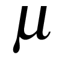
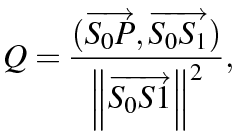

Puzzle - Zalando’s next top analyst
===================================

The Zalando Data Intelligence Team is searching for a new top analyst.
We already know of an excellent candidate with top analytical and
programming skills. Unfortunately, we don’t know her exact whereabouts
but we only have some vague information where she might be. Can you tell
us where to best send our recruiters and plot an easy to read map of
your solution for them?

This is what we could extract from independent sources:

-   The candidate is likely to be close to the river Spree. The
    probability at any point is given by a Gaussian function of its
    shortest distance to the river. The function peaks at zero and has
    95% of its total integral within +/-2730m.

-   A probability distribution centered around the Brandenburg Gate also
    informs us of the candidate’s location. The distribution’s radial
    profile is log-normal with a mean of 4700m and a mode of 3877m in
    every direction.

-   A satellite offers further information: with 95% probability she is
    located within 2400 m distance of the satellite’s path (assuming a
    normal probability distribution).

Please make use of the additional information in the file
http://bit.ly/19fdgVa. Kindly send us the solution with both code and
diagrams along with your application, it will help us better assess your
skills.

My solution
===========

What we are being asked to do is to calculate the joint probability
density and use it to find Zalando’s next top analyst. The joint
probability density is constructed by combining the probability
distributions given in the problem definition. These distributions
denote the probability of finding the analyst at a given position from
landmarks in Berlin.\
For a general position let the probability of finding the analyst using
the distribution associated with landmark A be P(A). The probability
then of finding the analyst using the distribution associated with
landmark B is P(B). The joint probability P(A,B) is then the probability
of finding the analyst at the chosen position using both the
distributions associated with landmarks A and B. How this quantity is
calculated is predicated on whether the probabilities are dependent on
each other, i.e. the value of one affects the other. That is not the
case here, the observations are *independent*, so the joint probability
for two distributions is P(A,B) = P(A)\*P(B). For this problem the join
probability density at a given point is the product of all the
probability density functions evaluated at that point.\
In the following sections I outline the steps I performed to solve this
problem. I present the calculated location of Zalando’s next top
analyst, along with plots of the individual probability density
functions as well as the joint probability density function.

Get background image
--------------------

As the problem wants us to use the joint probability distribution
function (PDF) to find the location of the analyst, it makes sense to
plot the PDF on top of a map of Berlin. Using [Google maps static
API](http://developers.google.com/maps/documentation/static-maps/) a
background image is downloaded with the locations of the landmarks
mentioned in the question marked.

Here the satellites path is shown as the green line, the piecwise linear approximation of the river Spree as the blue line and the Brandenburg Gate as the red pin. 

Get corners of background image
-------------------------------

Using the code sketch from [the Google maps javascript
API](http://developers.google.com/maps/documentation/javascript/examples/map-coordinates)
we can get the latitude and longitude of the corners of the background
image. Using the north-west boundary point as the origin we can then
convert any latitude and longitude position into a pixel coordinate.
This is done by first using the Mercator projection to find the x,y
displacement from the origin and then multiplying this by the scale
factor,

where zoom is the zoom level of the background map. This mapping, along
with the reverse pixel location to latitude-longitude, combined with the
Mercator distance formula from the additional information file allows us
to plot the joint PDF required to find the next top analyst.

The joint probability distribution function
-------------------------------------------

The joint PDF is defined as,

where ,  and
 are the PDFs centered on the Brandenburg
gate, satellite path and the river Spree. In the following sections we
define the parameters for each of the PDFs.

### The Brandenburg gate distribution

We are told the PDF associated with the Brandenburg gate has a radial
profile which is log-normal with a mean of 4700m and a mode of 3877m in
every direction. We know the mean and mode of a log-normal distribution
are,

with  and  being the two parameters of the distribution.
Rearrangement gives,

where log is the natural logarithm. These expressions give  = 1.483
and  = 0.358.

### The river Spree

The river Spree distribution is a Gaussian distribution following the
piece-wise approximation of the river given in the additional
information file. For the internal parameters we are told ‘The function
peaks at zero and has 95% of its total integral within +/-2730m.’ For a
Gaussian curve 95% of the distribution falls within . As
the distribution is centered on the river,  = 0 and from the distance
of 2730m we get  = 2.730 / 1.96 = 1.391.

To calculate the distance we need the shortest distance between the
point, P, in question and the river. To achieve this we
calculate the distances between P and the line fragments
making up the piece-wise linear approximation of the river Spree and
accepting the shortest distance. To find the distance between
P and a general line segment defined by the points
 and , we must calculate the distance from
either the point to the line defined by the endpoints *or* the distance
from the point to one of the end points. To determine which of these
distances we should use first we need to calculate the normalised
projection of P onto the line segment,

where  is the vector from point 
to , (u,v) is the Euclidean inner-product and
 the Euclidean norm. If 0 ≤ Q ≤ 1, the distance from P to the line defined by
 and  should be used. If Q > 1 the distance
from P to  is to be used and P to
 if Q < 0. The reason behind this is that if Q < 0 or
Q > 1 then the point P lies far away from the segment and the
distance to one of the end points should be used instead.

### The satellite’s path distribution

This is normal distribution with 95% probability the next top analyst is
located within 2400 m distance of the satellite’s path. Using the same
expression for the river Spree feature we get
 = 2.4 / 1.96 = 1.224. Distances are calculated from
P to the line defined by  and ,
where  and  are points on the great circle
path the satellite transverses. As the map distances we are relatively
small, ≈20km, the circular path of the satellite can be
approximated by a straight line.

Evaluate the joint PDF on a grid
--------------------------------

In order to plot the joint PDF on top of the background map, we first
calculate the joint PDF at all points on a grid. Using the pixel to
latitude-longitude mapping functions mentioned earlier the grid points
can be mapped to latitude and longitude and the PDFs can be evaluated
and combined. By using cubic interpolation we can plot a smooth joint
PDF at a significantly reduced computational cost.

Estimate of errors
------------------

From the sampled values of the joint PDF we construct the set $S$ of all
the possible values we have calculated the joint PDF to be. From this
set we use the variable $X$ to draw random samples and with this
construct a cumulative distribution function (CDF),

$$F_X(x) = P(X \le x),$$

where $P(X \le x)$ is the probability that the random variable, $X$,
takes a value less than or equal to $x$. The location of the next
analyst will be at $X_\text{max}$, the maximum observed sample value,
and $F_X(X_\text{max}) = 1$. The value $X_{99}$ will bound the 1% error
in the analyst position. This can be calculated from

$$F_X(X_{99}) = 0.99 \rightarrow X_{99} = F^{-1}_X(0.99),
\label{eqn_99}$$

where $F^{-1}_X(x)$ is the inverse of the CDF. Plotting the CDF allows
us to estimate $X_{99}$ and $X_{95}$, the 1% and 5% errors in the next
top analyst position. Figure [fig:cdf] shows the plotted CDF and the
estimated values of $X_{99}$ and $X_{95}$.

Results
=======

Figure [fig:map] shows the background map taken from Google maps. The
key locations of the Brandenburg gate, the piece-wise approximation of
the river Spree and the satellite path are also plotted. The individual
PDFs associated with these locations are plotted in Figures [fig:gate],
[fig:river], [fig:sat]. Figure [fig:joint] shows the plot of the joint
PDF overlaid on top of the background map. The joint PDF suggests that
Zalando’s next top analyst can be found at (52.511537, 13.455012). Also
shown on the plot are several other Zalando offices with half of these
falling within the contour denoting the 5% error in the location. This
suggests that Zalando’s next top analyst is either very close or
possibly already working in one of their Berlin offices!

Cumulative distribution function of the sampled joint PDF values\label{fig:cdf} CDF for estimating the errors in the analyst location. Using equation \eqref{eqn_99} values within 1\% and 5\% of the maximum joint PDF value are estimated, shown in blue and purple. These are used as the bounds for the 1\% and 5\% errors in the location of the next top analyst and are shown in Figure \ref{fig:joint}.}
